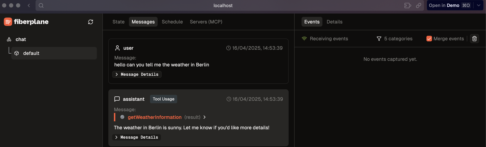

# Fiberplane's Agent Hackchallenge featuring Cloudflare Agents
This repo/ templates extends the [Cloudflare Agents Starter Kit](https://github.com/cloudflare/agents-starter) with additional features and tools.

It includes the Fiberplane Agent Playground to inspect your agent's state, memory and behaviour. 

Addionally it includes a tool to add a MCP server to the agent and a tool to send emails using [Resend](https://resend.com). You can find the tool in the `tools.ts` file.

## Getting started challenge:
- Clone this repo
- in order to use the chat agent and the addional tools inculde the following into your `.dev.vars`
    - `OPENAI_API_KEY` to make use of the chat agent
    - `HOST=http://localhost:5173` to make use of including MCP Server
    - `RESEND_API_KEY` to make use of the email tool

- run `npm install`
- run `npm start`

You might get an error saying: `server.ts does not export a default entrypoint.`
Just restart the application!

To get insight into your agent visit the `/fp` endpoint! You can see the agent's state and memory there.



You are all setup for continuing the challenge! You can take two pathes from here:
1. Add new tools in `tools.ts` to empower your agent to do more intresting things, some ideas:
    - Add a tool to get News from an API
    - Add a tool to get some Stock market data
    - ...
2. Create an MCP server and add it to the agent


## 1 Agent Tools
For adding tools we focus on the `tool.ts` file. If you add a new tool there your agent will have access to it. 

```typescript
const getNumberFact = tool({
  description: "Get an interesting fact about a specific number",
  parameters: z.object({
    number: z.number().describe("The number to get a fact about")
  }),
  execute: async ({ number }) => {
    try {
      const response = await fetch(`https://numbersapi.com/${number}`);
      if (!response.ok) {
        throw new Error(`HTTP error! status: ${response.status}`);
      }
      const fact = await response.text();
      return fact;
    } catch (error: any) {
      const errorMessage = error.message || "Unknown error occurred";
      return `Error getting number fact: ${errorMessage}`;
    }
  },
});

```


This tool will basically fetch the `numbersapi.com` and give a random fact about a number. Of course that is something the chat agent with OpenAI as LLM in the background can also do, but this way you don't eat up for credits and it is just a way to outline how to add a tool to the agent. 

## 2 MCP Server
In order to give your agent more capabilities you can add an MCP server to the agent. You can connect to an existing MCP server or create your own using muppet.io.: 
- [This list](https://mcp.composio.dev/) inculdes some existing MCP servers ready to use. 
- Use [muppet.io](https://www.muppet.dev/docs) to create your own MCP server

Simply chat to your agent and let it now you like to add an MCP server to it and provide it with the URL of the MCP server. 

Once the MCP server is added you can see it in Fiberplane's agent playground.


And you can inspect the MCP server's capabilities in Fiberplane's agent playground.


💡 If you restart the application you will have to add the MCP server again. 


------------------------

# 🤖 Chat Agent Starter Kit Docs from Cloudflare 


<a href="https://deploy.workers.cloudflare.com/?url=https://github.com/cloudflare/agents-starter"></a>

A starter template for building AI-powered chat agents using Cloudflare's Agent platform, powered by [`agents`](https://www.npmjs.com/package/agents). This project provides a foundation for creating interactive chat experiences with AI, complete with a modern UI and tool integration capabilities.

## Features

- 💬 Interactive chat interface with AI
- 🛠️ Built-in tool system with human-in-the-loop confirmation
- 📅 Advanced task scheduling (one-time, delayed, and recurring via cron)
- 🌓 Dark/Light theme support
- ⚡️ Real-time streaming responses
- 🔄 State management and chat history
- 🎨 Modern, responsive UI

## Prerequisites

- Cloudflare account
- OpenAI API key

## Quick Start

1. Create a new project:

```bash
npm create cloudflare@latest -- --template cloudflare/agents-starter
```

2. Install dependencies:

```bash
npm install
```

3. Set up your environment:

Create a `.dev.vars` file:

```env
OPENAI_API_KEY=your_openai_api_key
```

4. Run locally:

```bash
npm start
```

5. Deploy:

```bash
npm run deploy
```

## Project Structure

```
├── src/
│   ├── app.tsx        # Chat UI implementation
│   ├── server.ts      # Chat agent logic
│   ├── tools.ts       # Tool definitions
│   ├── utils.ts       # Helper functions
│   └── styles.css     # UI styling
```

## Customization Guide

### Adding New Tools

Add new tools in `tools.ts` using the tool builder:

```typescript
// Example of a tool that requires confirmation
const searchDatabase = tool({
  description: "Search the database for user records",
  parameters: z.object({
    query: z.string(),
    limit: z.number().optional(),
  }),
  // No execute function = requires confirmation
});

// Example of an auto-executing tool
const getCurrentTime = tool({
  description: "Get current server time",
  parameters: z.object({}),
  execute: async () => new Date().toISOString(),
});

// Scheduling tool implementation
const scheduleTask = tool({
  description:
    "schedule a task to be executed at a later time. 'when' can be a date, a delay in seconds, or a cron pattern.",
  parameters: z.object({
    type: z.enum(["scheduled", "delayed", "cron"]),
    when: z.union([z.number(), z.string()]),
    payload: z.string(),
  }),
  execute: async ({ type, when, payload }) => {
    // ... see the implementation in tools.ts
  },
});
```

To handle tool confirmations, add execution functions to the `executions` object:

```typescript
export const executions = {
  searchDatabase: async ({
    query,
    limit,
  }: {
    query: string;
    limit?: number;
  }) => {
    // Implementation for when the tool is confirmed
    const results = await db.search(query, limit);
    return results;
  },
  // Add more execution handlers for other tools that require confirmation
};
```

Tools can be configured in two ways:

1. With an `execute` function for automatic execution
2. Without an `execute` function, requiring confirmation and using the `executions` object to handle the confirmed action

### Use a different AI model provider

The starting [`server.ts`](https://github.com/cloudflare/agents-starter/blob/main/src/server.ts) implementation uses the [`ai-sdk`](https://sdk.vercel.ai/docs/introduction) and the [OpenAI provider](https://sdk.vercel.ai/providers/ai-sdk-providers/openai), but you can use any AI model provider by:

1. Installing an alternative AI provider for the `ai-sdk`, such as the [`workers-ai-provider`](https://sdk.vercel.ai/providers/community-providers/cloudflare-workers-ai) or [`anthropic`](https://sdk.vercel.ai/providers/ai-sdk-providers/anthropic) provider:
2. Replacing the AI SDK with the [OpenAI SDK](https://github.com/openai/openai-node)
3. Using the Cloudflare [Workers AI + AI Gateway](https://developers.cloudflare.com/ai-gateway/providers/workersai/#workers-binding) binding API directly

For example, to use the [`workers-ai-provider`](https://sdk.vercel.ai/providers/community-providers/cloudflare-workers-ai), install the package:

```sh
npm install workers-ai-provider
```

Add an `ai` binding to `wrangler.jsonc`:

```jsonc
// rest of file
  "ai": {
    "binding": "AI"
  }
// rest of file
```

Replace the `@ai-sdk/openai` import and usage with the `workers-ai-provider`:

```diff
// server.ts
// Change the imports
- import { openai } from "@ai-sdk/openai";
+ import { createWorkersAI } from 'workers-ai-provider';

// Create a Workers AI instance
+ const workersai = createWorkersAI({ binding: env.AI });

// Use it when calling the streamText method (or other methods)
// from the ai-sdk
- const model = openai("gpt-4o-2024-11-20");
+ const model = workersai("@cf/deepseek-ai/deepseek-r1-distill-qwen-32b")
```

Commit your changes and then run the `agents-starter` as per the rest of this README.

### Modifying the UI

The chat interface is built with React and can be customized in `app.tsx`:

- Modify the theme colors in `styles.css`
- Add new UI components in the chat container
- Customize message rendering and tool confirmation dialogs
- Add new controls to the header

### Example Use Cases

1. **Customer Support Agent**

   - Add tools for:
     - Ticket creation/lookup
     - Order status checking
     - Product recommendations
     - FAQ database search

2. **Development Assistant**

   - Integrate tools for:
     - Code linting
     - Git operations
     - Documentation search
     - Dependency checking

3. **Data Analysis Assistant**

   - Build tools for:
     - Database querying
     - Data visualization
     - Statistical analysis
     - Report generation

4. **Personal Productivity Assistant**

   - Implement tools for:
     - Task scheduling with flexible timing options
     - One-time, delayed, and recurring task management
     - Task tracking with reminders
     - Email drafting
     - Note taking

5. **Scheduling Assistant**
   - Build tools for:
     - One-time event scheduling using specific dates
     - Delayed task execution (e.g., "remind me in 30 minutes")
     - Recurring tasks using cron patterns
     - Task payload management
     - Flexible scheduling patterns

Each use case can be implemented by:

1. Adding relevant tools in `tools.ts`
2. Customizing the UI for specific interactions
3. Extending the agent's capabilities in `server.ts`
4. Adding any necessary external API integrations

## Learn More

- [`agents`](https://github.com/cloudflare/agents/blob/main/packages/agents/README.md)
- [Cloudflare Agents Documentation](https://developers.cloudflare.com/agents/)
- [Cloudflare Workers Documentation](https://developers.cloudflare.com/workers/)

## License

MIT
